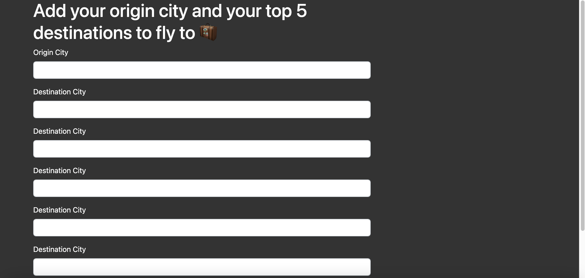
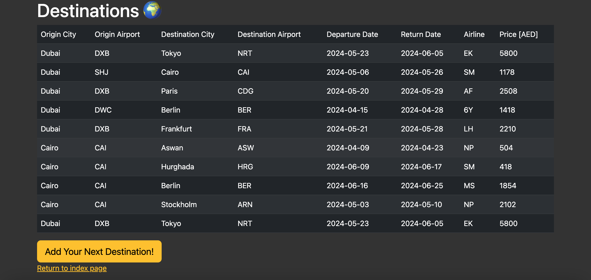

# Flights Search API Wesbite

## 
### Description
This is an online website to find the best flight deals for your next destination using [Tequila API](https://partners.kiwi.com/our-solutions/tequila/) from Kiwi. 

### Project motivation
I completed this portfolio website, as one of the assignments in professional [Python 100 Days bootcamp](https://www.udemy.com/course/100-days-of-code/) by [Dr. Angela Yu](https://github.com/angelabauer).

### Quick Start
- Static version at [GitHub Pages](https://jvsadek.github.io/Cafe_Website/)

[//]: # (- Dynamic version at [Render hosted]&#40;https://portfolio-website-d1x4.onrender.com&#41;)
